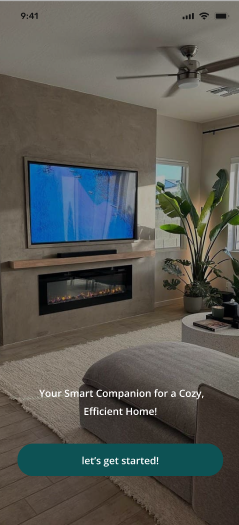

<br><br>

<!-- project philosophy -->


> Power Down is dedicated to revolutionizing home energy consumption by offering intelligent solutions that help homeowners save energy and reduce their carbon footprint.
>
> Our user-friendly platform empowers users to monitor, manage, and optimize their home's energy use effortlessly. We believe in promoting sustainable living through innovative technology, ultimately contributing to a greener future while enhancing the comfort and efficiency of modern homes.

### User Stories
#### User
- As a user,  I want to monitor my energy consumption, so I can understand my usage patterns and identify areas for improvement.
- As a user, I want to receive tips and recommendations for saving energy, so I can implement effective energy-saving practices.
- As a user, I want to set energy-saving goals, so I can track my progress and stay motivated to reduce my energy consumption.

#### Admin
- As an admin, I want to browse all users, so I can monitor their energy consumption and manage their accounts effectively.
- As an admin, I want to create new user accounts, so I can onboard users who want to monitor their energy consumption.
- As an admin, I want to delete user accounts, so I can remove inactive or unnecessary accounts from the system.

<br><br>
<!-- Tech stack -->


###  Powerdown is built using the following technologies:

- This project uses the [Flutter app development framework](https://flutter.dev/). Flutter is a cross-platform hybrid app development platform which allows us to use a single codebase for apps on mobile, desktop, and the web.
- For persistent storage (database), the app utilizes [MongoDB](https://www.mongodb.com/), a NoSQL database that offers flexibility in schema design, enabling the app to store and manage data in a scalable and efficient manner.
- The backend is built using [Express.js](https://expressjs.com/), a minimal and flexible [Node.js](https://nodejs.org/en) web application framework, along with Node.js, a JavaScript runtime that allows for scalable network applications.

<br><br>
<!-- UI UX -->


> We designed Powerdown using wireframes and mockups, iterating on the design until we reached the ideal layout for easy navigation and a seamless user experience.

- Project Figma design [figma](https://www.figma.com/design/6dniumzy0qMa51RXaKIkFo/Final-project-wireframes?node-id=22-97&node-type=frame&t=786XkcAV43wDiIb1-0)


### Mockups
| Welcome screen  | Home Screen | Add Rooms Screen |
| ---| ---| ---|
|  |  |  |

<br><br>

<!-- Database Design -->


###  Architecting Data Excellence: Innovative Database Design Strategies:


<br><br>


<!-- Implementation -->


### User Screens (Mobile)
| Login screen  | Register screen | Landing screen | Loading screen |
| ---| ---| ---| ---|
|  |  |  |  |
| Home screen  | Menu Screen | Order Screen | Checkout Screen |
|  |  |  |  |

<!-- ### Admin Screens (Web)
| Login screen  | Register screen |  Landing screen |
| ---| ---| ---|
|  |  |  |
| Home screen  | Menu Screen | Order Screen |
|  |  |  | -->

<br><br>


<!-- Prompt Engineering -->


###  Mastering AI Interaction: Unveiling the Power of Prompt Engineering:

- This project uses advanced prompt engineering techniques to optimize the interaction with natural language processing models. By skillfully crafting input instructions, we tailor the behavior of the models to achieve precise and efficient language understanding and generation for various tasks and preferences.

<br><br>

<!-- AWS Deployment -->


###  Efficient AI Deployment: Unleashing the Potential with AWS Integration:

- This project leverages AWS deployment strategies to seamlessly integrate and deploy natural language processing models. With a focus on scalability, reliability, and performance, we ensure that AI applications powered by these models deliver robust and responsive solutions for diverse use cases.

<br><br>

<!-- Unit Testing -->
<!-- 

###  Precision in Development: Harnessing the Power of Unit Testing:

- This project employs rigorous unit testing methodologies to ensure the reliability and accuracy of code components. By systematically evaluating individual units of the software, we guarantee a robust foundation, identifying and addressing potential issues early in the development process.

<br><br> -->


<!-- How to run -->


> To set up Powerdown locally, follow these steps:

### Prerequisites

Make sure you have the following installed:cha
* npm
  ```sh
  npm install npm@latest -g
  ```
  ```sh
  npm install express
  ```
  ```sh
  npm install -g nodemon
  ```
  ```sh
  npm install dotenv
  ```
  ```sh
  npm install express
  ```
* flutter
 
  ```sh
  flutter run
  ```


### Installation

_Below is an example of how you can instruct your audience on installing and setting up your app. This template doesn't rely on any external dependencies or services._

1. Get an API Key at [OpenAI](https://beta.openai.com/signup/)
2. Clone the repo
   git clone [Powerdown](https://github.com/ali9issa99/Powerdown-Fullstack.git)
3. Install NPM packages
   ```sh
   npm install
   ```
4. Enter your API in `.env`
   ```js
   OPENAI_API_KEY="ENTER YOUR OPENAI API KEY"
   ```
5. Run the backend
   ```sh
   node index.js
   ```
6. Navigate to the frontend directory
   ```sh
   cd ../frontend
   ```
7. Run the backend
   ```sh
   flutter run
   ```   

Now, you should be able to run Powerdown locally and explore its features.